# BookShelf

### Identitas

**Nama**: Rafa Umar Abdus Syakur

**NIM**: 2410501045

**Kelas**: B

## Tema Project

**C: BookShelf**

BookShelf adalah aplikasi berbasis React Native (TypeScript) yang dirancang untuk menjadi
perpustakaan digital pribadi Anda di telapak tangan Anda.

## Tech Stack

Berikut teknologi utama yang digunakan:

### Core

- React `19.2.0`
- React Native `0.83.6`
- Expo `~55.0.17`

### Navigation & Routing

- Expo Router `~55.0.13`
- React Navigation `^7.1.33`

### State Management

- Zustand `^5.0.12`

### Data Fetching

- Axios `^1.15.2`
- TanStack React Query `^5.100.1`

### Styling & UI

- NativeWind `^4.2.3`
- TailwindCSS `^3.4.19`
- Moti `^0.30.0`
- Expo/vector-icons `^15.1.1`

### Storage

- Async Storage `2.2.0`

## Installation & Run

```bash
# Clone repository
git clone https://github.com/Eclipse-02/uts-mobile-lanjut-2410501045-Rafa-Umar-Abdus-Syakur.git

# Masuk ke folder
cd uts-mobile-lanjut-2410501045-Rafa-Umar-Abdus-Syakur

# Install dependencies
npm install

# Jalankan project
npx expo start
```

## Screenshots

Semua screenshot berada di folder:

```
./assets/images/screenshots
```

Terdapat 7 tampilan untuk tema Light dan Dark:

- Home Screen
- Bookmarks
- Browse Screen
- Search Result
- About
- Book Detail
- Browse by Subject

### Home Screen

<p align="center">
   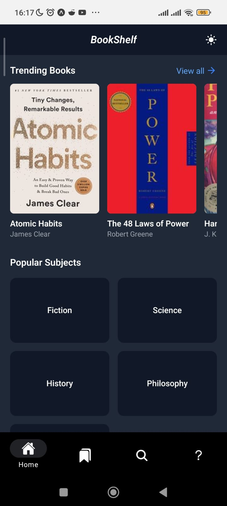
   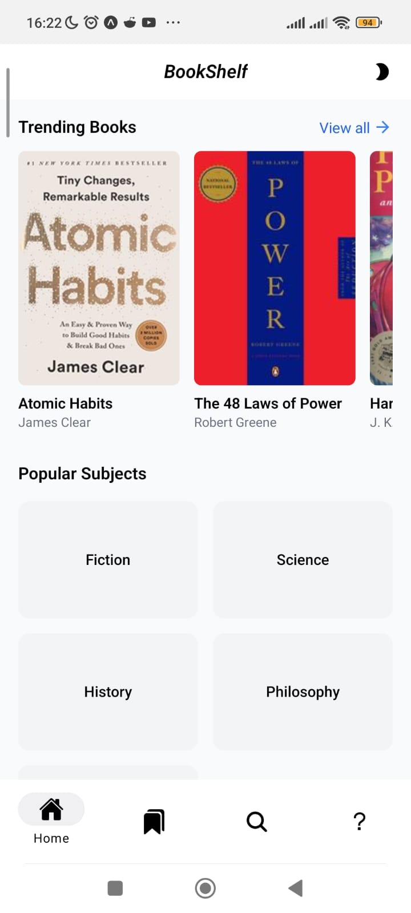
</p>

### Bookmarks

<p align="center">
   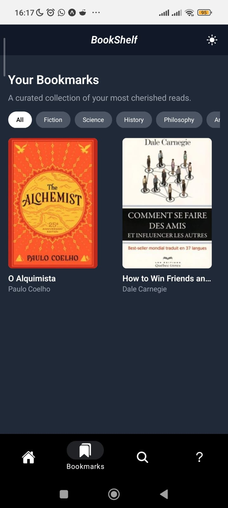
   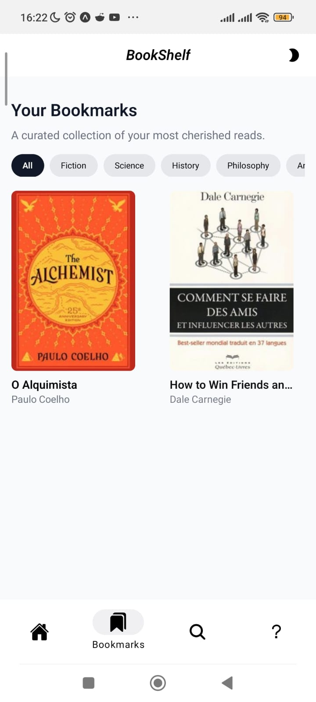
</p>

### Browse Screen

<p align="center">
   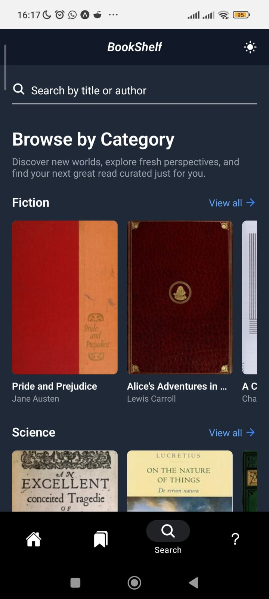
   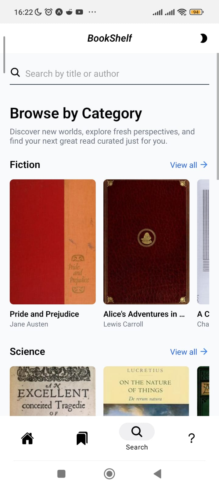
</p>

### Search Result

<p align="center">
   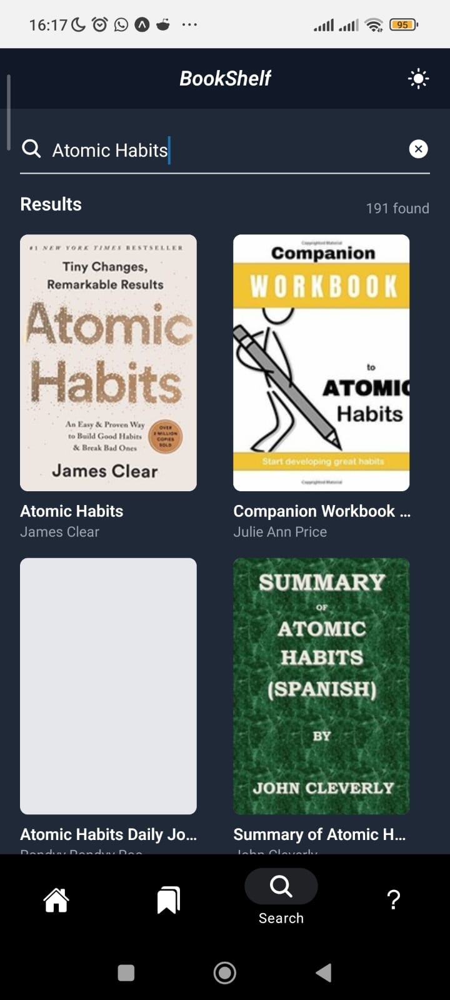
   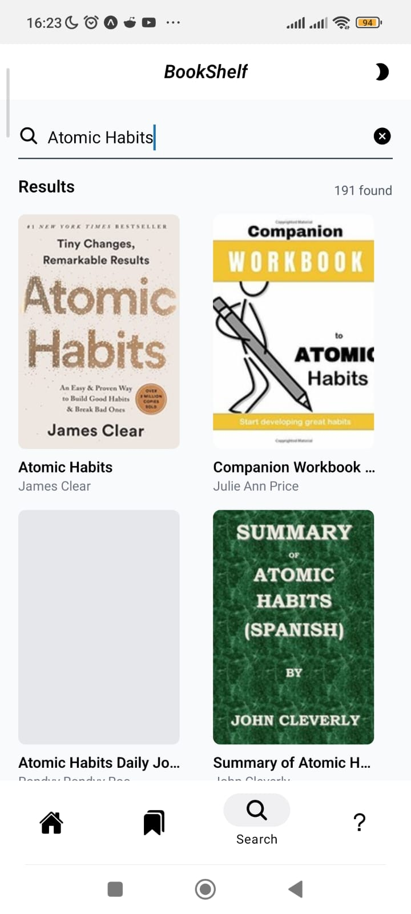
</p>

### About

<p align="center">
   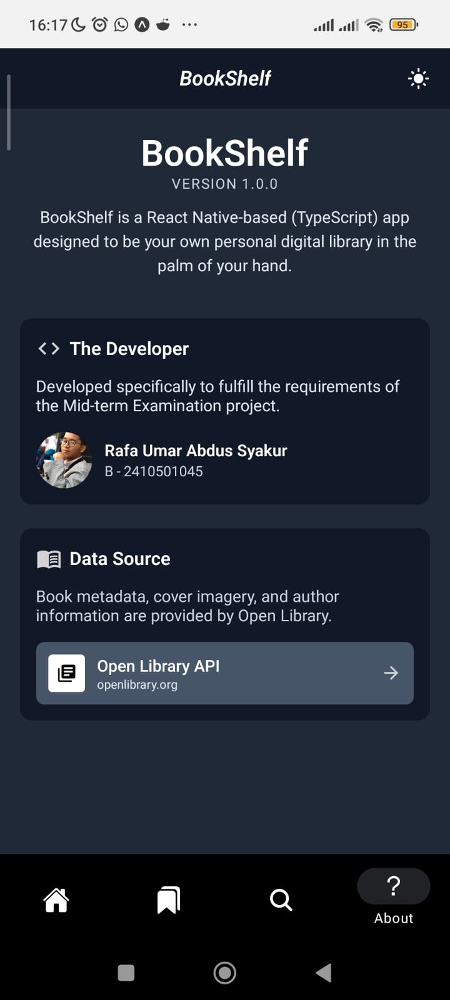
   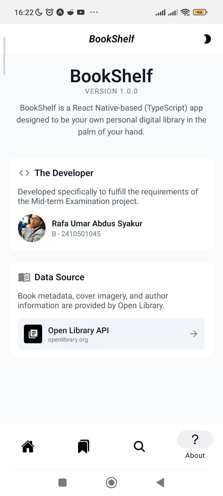
</p>

### Book Detail

<p align="center">
   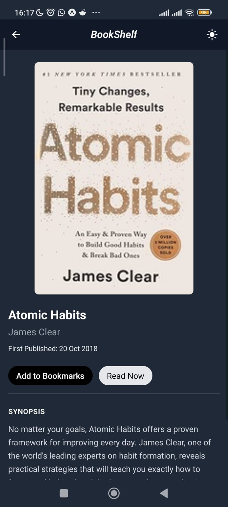
   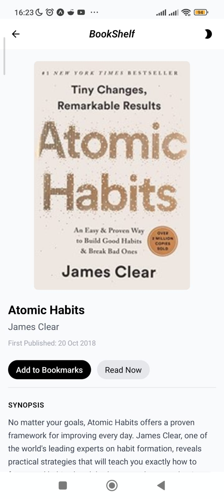
</p>

### Browse by Subject

<p align="center">
   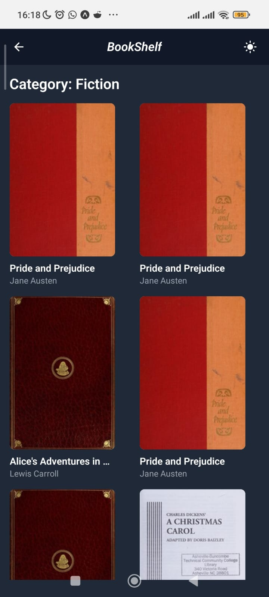
   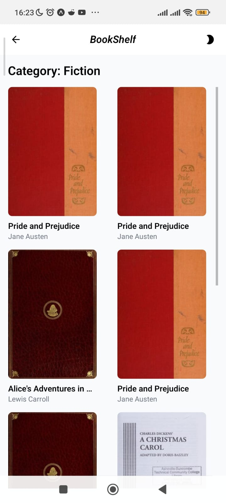
</p>

## Demo Video

Link demo: [Google Drive](https://drive.google.com/file/d/1KTaYSp3YRQM4GumyuO2MySJ0In_cVqxH/view?usp=drive_link)

## State Management

Project ini menggunakan **Zustand** sebagai state management utama, khususnya untuk fitur **Bookmarks**.

### Alasan memilih Zustand:

* Lebih ringan dibanding Redux
* Penggunaan ringan, untuk Bookmarks saja
* Tidak membutuhkan boilerplate kompleks
* Mudah diintegrasikan dengan React Native
* Mendukung middleware `persist` untuk AsyncStorage

### Implementasi:

* Data bookmark disimpan dalam bentuk object (`Record<string, Book>`)
* Menggunakan `persist` untuk menyimpan ke AsyncStorage
* Memiliki state `hydrated` untuk menangani delay saat rehydration

## Referensi

Berikut referensi yang digunakan selama pengembangan:

- React Native
  - [Activity Indicator](https://reactnative.dev/docs/activityindicator)
  - [Refresh Control](https://reactnative.dev/docs/refreshcontrol)
  - [Linking](https://reactnative.dev/docs/linking#open-links-and-deep-links-universal-links)

- Expo
  - [NativeTabs](https://docs.expo.dev/router/advanced/native-tabs)
  - [NativeTabs Props](https://docs.expo.dev/versions/latest/sdk/router/native-tabs/#components)
  - [Dynamic Routing](https://docs.expo.dev/router/basics/navigation/#dynamic-routes-and-url-parameters)
  - [Navigation Params](https://docs.expo.dev/router/reference/typed-routes/#route-parameters)
  - [LocalSearchParams](https://docs.expo.dev/router/reference/url-parameter/#statically-typed-url-parameters)
  - [Vector Icons](https://docs.expo.dev/guides/icons/)
  - [Vector Icons Library](https://icons.expo.fyi/Index)

- Axios
  - [Instalasi](https://axios.rest/pages/getting-started/first-steps)
  - [Usage In Typescript](https://axios.rest/pages/getting-started/examples/typescript.html)
  - [Interceptors](https://axios.rest/pages/advanced/interceptors.html)
  - [Try-catch Handling](https://axios.rest/pages/advanced/retry.html)

- TanStack Query
  - [Instalasi](https://tanstack.com/query/latest/docs/framework/react/installation)
  - [Usage In TypeScript](https://tanstack.com/query/latest/docs/framework/react/typescript)
  - [QueryClient](https://tanstack.com/query/latest/docs/framework/react/reference/QueryClientProvider)
  - [Use Query](https://tanstack.com/query/latest/docs/framework/react/guides/queries)
  - [Infinite Query](https://tanstack.com/query/latest/docs/framework/react/guides/infinite-queries)

- Zustand
  - [Instalasi](https://zustand.docs.pmnd.rs/learn/getting-started/introduction)
  - [Persist](https://zustand.docs.pmnd.rs/reference/middlewares/persist#persisting-a-state)
  - [createJSONStorage](https://zustand.docs.pmnd.rs/reference/integrations/persisting-store-data#typescript-simple-example)
  - [Hydration](https://zustand.docs.pmnd.rs/reference/integrations/persisting-store-data#onrehydratestorage)

- Async Storage
  - [Instalasi](https://react-native-async-storage.github.io/2.0/Installation)
  - [Usage](https://react-native-async-storage.github.io/2.0/Usage)

- NativeWind
  - [Instalasi](https://www.nativewind.dev/docs/getting-started/installation)
  - [User Toggle Theme](https://www.nativewind.dev/docs/core-concepts/dark-mode#2-manual-selection-user-toggle)

- Moti
  - [Instalasi](https://moti.fyi/installation)
  - [Skeleton Loading](https://moti.fyi/skeleton)

- Open Library API
  - [General API Documentation](https://openlibrary.org/developers/api)
  - [Search API](https://openlibrary.org/dev/docs/api/search)
  - [Cover API](https://openlibrary.org/dev/docs/api/covers)
  - [Author API](https://openlibrary.org/dev/docs/api/authors)
  - [Subject API](https://openlibrary.org/dev/docs/api/subjects)

- Lainnya:
  - [React + OpenLibrary API Tutorial](https://www.youtube.com/watch?v=OhsaJFPNZts)
  - [Zustand + AsyncStorage Persist](https://github.com/pmndrs/zustand/issues/394)
  - [ScrollView Issue](https://stackoverflow.com/questions/38942869/react-native-scrollview-is-not-scrolling-to-the-bottom-sometimes)
  - [VirtualizedLists and ScrollView Issue](https://stackoverflow.com/questions/67623952/error-virtualizedlists-should-never-be-nested-inside-plain-scrollviews-with-th)
  - [QueryClientIssue](https://stackoverflow.com/questions/65590195/error-no-queryclient-set-use-queryclientprovider-to-set-one)
  - [Order of Hooks Issue](https://stackoverflow.com/questions/57397395/react-has-detected-a-change-in-the-order-of-hooks-but-hooks-seem-to-be-invoked)
  - [Cannot Read Property of 'undefined' Issue](https://stackoverflow.com/questions/14782232/how-can-i-avoid-cannot-read-property-of-undefined-errors)
  - [Duplicate Key Issue](https://forum.freecodecamp.org/t/why-am-i-having-this-kind-of-warning-every-time-ill-a-product-warning-encountered-two-children-with-the-same-key/499632/10)
  - [Some()](https://developer.mozilla.org/en-US/docs/Web/JavaScript/Reference/Global_Objects/Array/some)
  - [Includes()](https://developer.mozilla.org/en-US/docs/Web/JavaScript/Reference/Global_Objects/Array/includes)
  - [Push()](https://developer.mozilla.org/en-US/docs/Web/JavaScript/Reference/Global_Objects/Array/push)
  - [WebView](https://aboutreact.com/load-local-html-file-url-using-react-native-webview)

## Refleksi Pengerjaan

Selama pengembangan aplikasi BookShelf ini, ada beberapa hal yang cukup menantang.
Salah satu yang pertama kali saya coba adalah pakai skeleton loading biar UX lebih enak saat data lagi 
di-fetch. Tapi di awal, tampilan skeleton-nya masih belum konsisten dengan UI aslinya. Mulai dari ukuran, 
spacing, sampai layout.

Selain itu, integrasi beberapa library seperti React Query, Zustand, dan NativeWind juga butuh penyesuaian, 
terutama supaya state dan UI tetap sinkron. Fitur seperti infinite scroll dan debounce search juga lumayan
susah karena harus benar-benar paham bagaimana cara kerja data fetching dan render di React.

Saya juga sempat menemui error "Cannot convert undefined value to object" yang awalnya saya kira karena
masalah hydration di Zustand. Tapi ternyata setelah ditelusuri, sumber utamanya justru dari file themes.ts
yang saya ubah strukturnya, sehingga komponen NativeTabs mencoba mengakses property yang tidak ada.

Untuk masalah hydration sendiri memang sempat terjadi, tapi penyebabnya karena kesalahan urutan hooks.
Setelah diperbaiki, error tersebut langsung hilang.

Saya juga sempat coba pakai WebView untuk buka halaman buku dari Open Library, tapi ternyata tidak diizinkan
dan muncul error "ERR_ACCESS_DENIED". Untuk penggantinya saya menggunakan Linking dari React Native.

Dari keseluruhan project ini, saya jadi lebih paham cara menyusun struktur aplikasi React Native yang rapi,
bikin custom hooks, dan handle data async dengan lebih baik. Selain itu, saya juga jadi lebih terbiasa
debugging error yang awalnya terlihat tidak jelas sumbernya, dan belajar untuk lebih teliti dalam membaca
struktur data dan dokumentasi sebelum langsung implementasi fitur.
